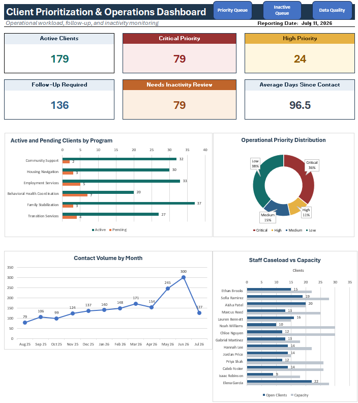

# Brett Coulter | Business Intelligence & Operations Portfolio

Welcome to my professional analytics portfolio.

This repository showcases business intelligence, healthcare operations, reporting automation, and data analytics projects inspired by real-world business challenges I've solved throughout my career.

Rather than focusing on public datasets, these projects demonstrate practical business solutions using recreated datasets and fictional scenarios to protect confidential information while highlighting the technical and analytical approaches used to solve complex operational problems.

---

## About Me

I'm a Business Systems Specialist with experience in:

- Healthcare Operations
- Business Intelligence
- Data Analysis
- Process Improvement
- Reporting Automation
- Dashboard Development
- Workflow Optimization

My background combines healthcare operations leadership with modern business analytics to develop solutions that improve reporting, reduce manual work, and support data-driven decision making.

---

## Technical Skills

### Analytics & Business Intelligence
- Microsoft Excel
- Microsoft Power BI
- Tableau
- SQL
- Power Query

### Data Analysis
- Dashboard Development
- KPI Reporting
- Data Visualization
- Data Quality
- Statistical Analysis

### Business Operations
- Business Process Improvement
- Workflow Automation
- Operational Reporting
- Healthcare Operations
- Claims Management

---

# Portfolio Projects

## ✅ [Client Prioritization & Operations Dashboard](./projects/client-operations-dashboard)

A complete client-operations reporting system built with Python, Microsoft Excel, and Power Query using fully fictional data.

The solution centralizes client, contact, staff, and program information; applies operational business rules; generates automated priority and inactivity queues; monitors staff capacity; and identifies data-quality exceptions.

**Key Features**

- Executive dashboard with operational KPI cards
- Automated Critical and High Priority Queue
- Automated Inactivity Review Queue
- Program-specific contact and inactivity thresholds
- Monthly contact-volume analysis
- Staff caseload versus capacity monitoring
- Client-level data-quality exception reporting
- Duplicate and invalid-reference validation
- Refreshable Power Query reporting workflow
- Workbook navigation and user instructions
- Python-generated fictional datasets
- Complete requirements, architecture, and design documentation

**Skills and Technologies**

- Python
- Microsoft Excel
- Power Query
- Data Modeling
- Business-Rule Development
- XLOOKUP
- Dynamic Arrays
- Dashboard Design
- Data-Quality Validation
- Git and GitHub
- Technical Documentation

[View the complete project](./projects/client-operations-dashboard)

---

## 🚧 Healthcare Claims Analytics Dashboard *(Planned)*

A recreated healthcare reimbursement reporting solution demonstrating claims monitoring, reimbursement tracking, KPI reporting, and operational dashboards.

**Skills**

- Excel
- Tableau
- Claims Analytics
- Revenue Cycle Analytics
- KPI Reporting

---

## 🚧 Provider Performance Dashboard *(Planned)*

A Power BI dashboard analyzing provider performance, operational trends, demographics, and key performance indicators using fictional datasets.

**Skills**

- Power BI
- DAX
- Data Modeling
- Data Visualization
- Reporting

---

## 🚧 Data Quality Monitoring System *(Planned)*

An automated reporting solution designed to identify data-quality issues, monitor completeness, validate relationships, and improve operational reporting consistency.

**Skills**

- Excel
- Power Query
- Data Validation
- Referential-Integrity Testing
- Reporting Automation

---

---

# Portfolio Philosophy

Every project in this portfolio follows the same framework:

1. Business Problem
2. Objective
3. Solution
4. Technical Skills
5. Business Impact
6. Future Improvements

The focus is not simply on building dashboards, but on demonstrating how analytics can solve meaningful business problems and improve organizational performance.

---

## Connect With Me

- LinkedIn: https://www.linkedin.com/in/brett-coulter

---

*All projects use recreated datasets and fictional examples. No confidential, proprietary, or protected information from current or former employers is included in this portfolio.*
